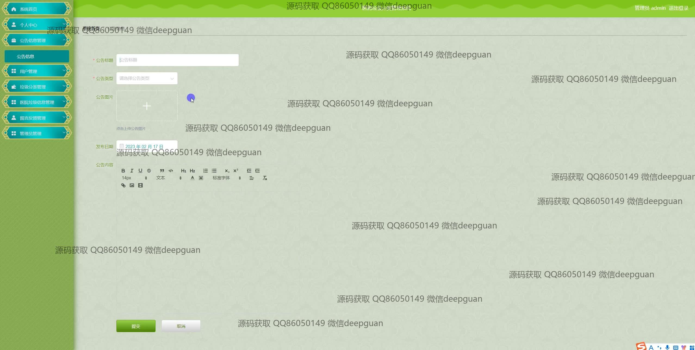
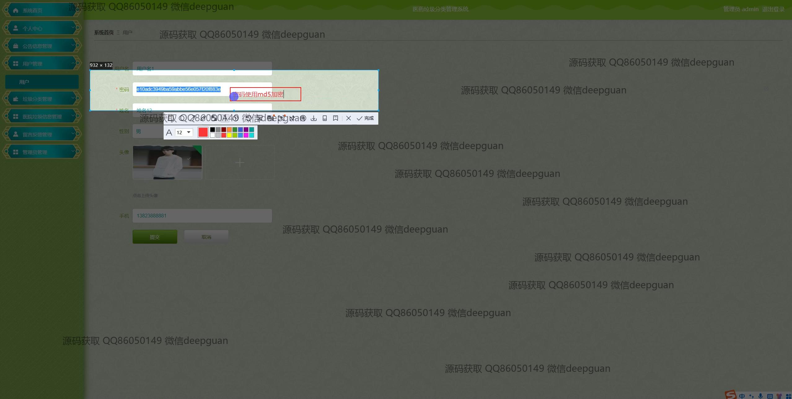
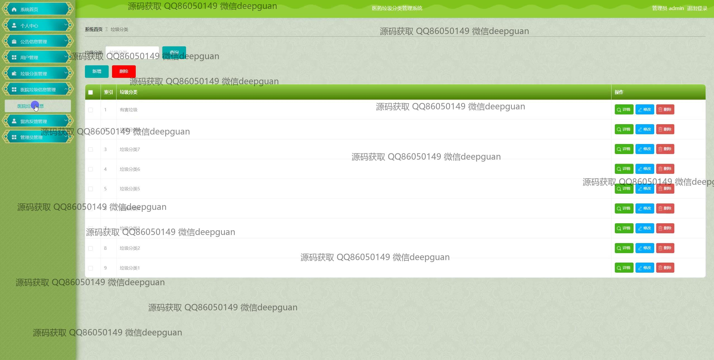
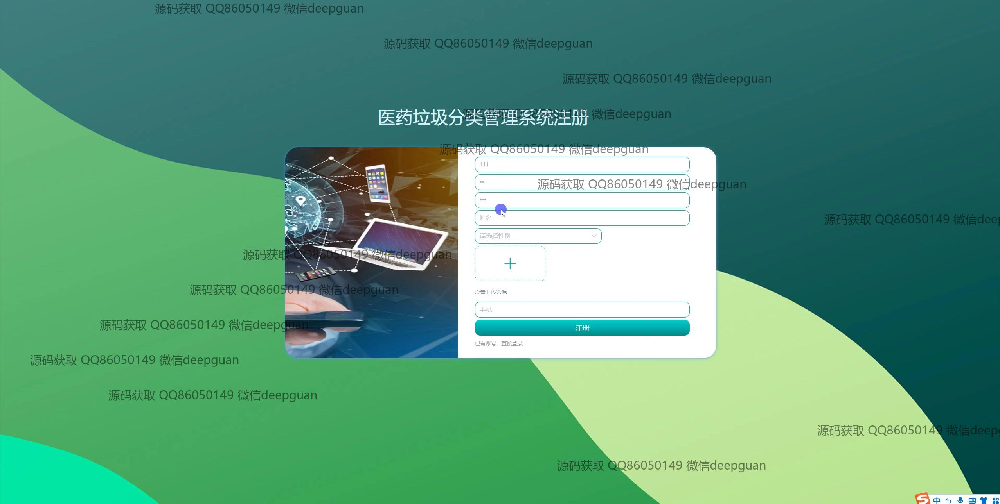
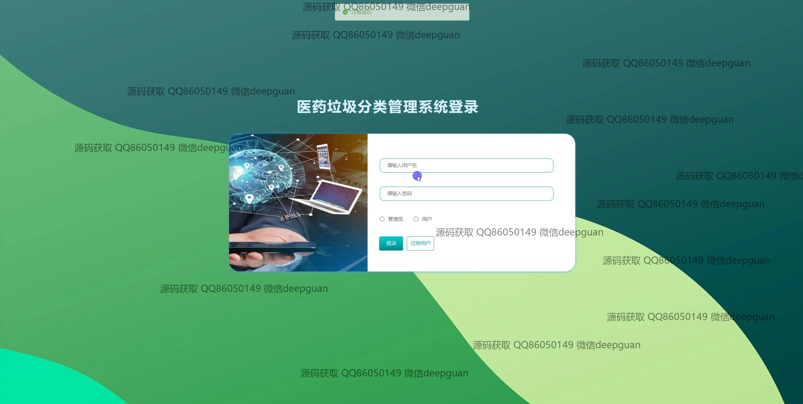
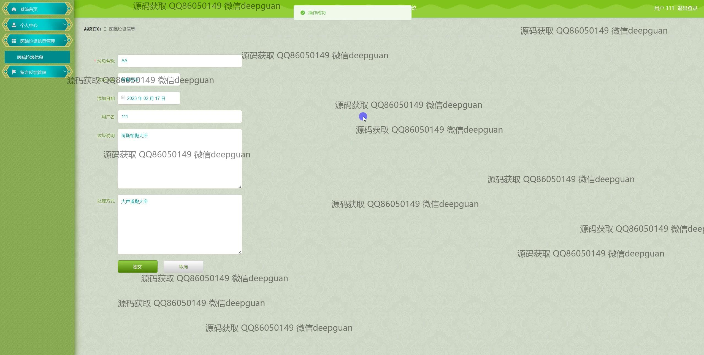
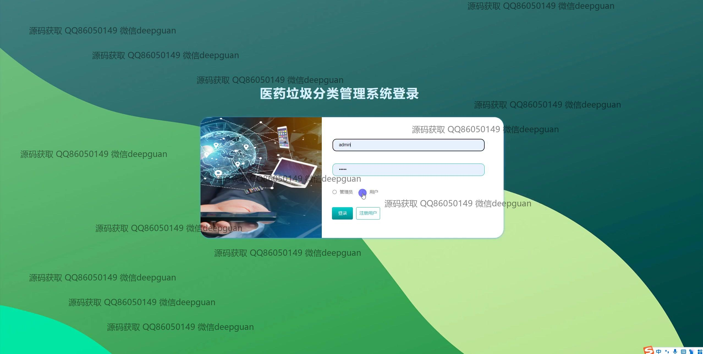
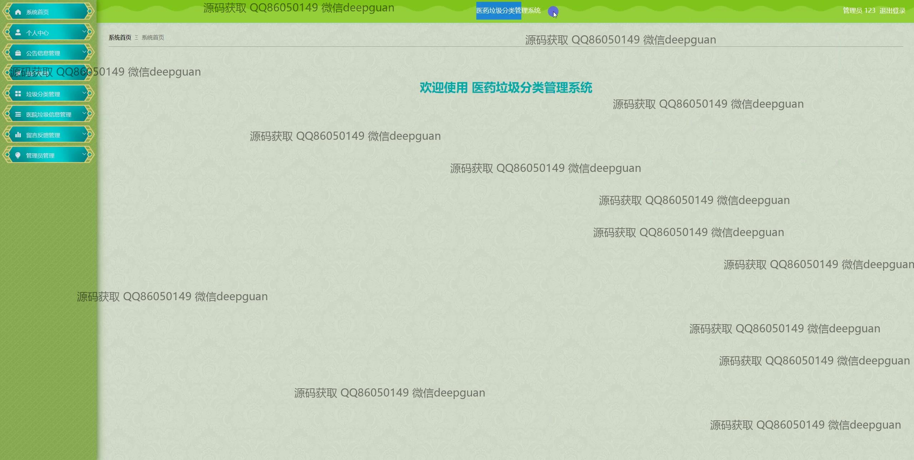

<h1 align="center">医药垃圾分类管理系统</h1>

## 简介
医药垃圾分类管理系统：角色分为管理员、用户；功能包括用户管理、垃圾分类管理、公告信息管理、医药垃圾信息管理、用户注册与登录功能。系统设计简洁，方便操作与管理，突出环保主题。    --计算机毕业设计源码；毕设源码；java毕业设计源码

## 联系方式

<h3 align="center">获取完整代码与数据库文件 + 微信：deepguan QQ: 86050149 QQ群: 783742310</h3>

<h3 align="center">可帮忙远程部署 包运行成功！提供远程部署、修改代码、设计文档指导、代码讲解等服务！</h3>

## 功能介绍（完整见运行截图）
管理员：提供系统的整体管理功能，包括登录、注册和退出选项。管理员可访问系统的主导航栏，管理网站公告、用户信息、垃圾分类、医药垃圾及管理员信息。管理员可以通过多功能菜单对公告信息进行查看、搜索、添加、修改和删除操作，管理垃圾类别和医院垃圾数据。同时，管理员可以监控系统的用户注册情况及各类垃圾信息处理，确保系统运行稳定，并对系统进行必要调整。

用户：用户能够通过系统进行登录和注册操作，访问主导航栏和个人中心。普通用户可以在系统中浏览和管理个人信息、查看公告、注册成为新用户，以及进行垃圾信息的登记和分类处理。个人中心允许用户查看和修改个人资料，管理个人收藏的垃圾信息。用户还可以通过系统的搜索功能快速找到所需的垃圾分类信息，并参与信息反馈和社区管理，提高系统使用效率和操作体验。

## 运行截图

本代码来源于网络,仅供学习参考使用!

